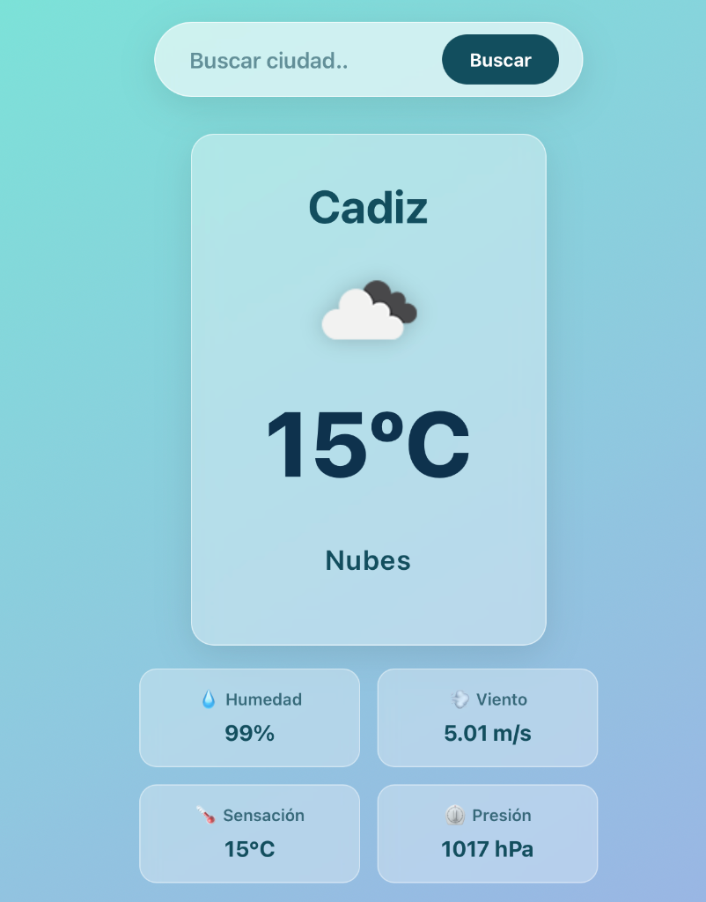

# 🌦️ App del Clima (Weather App)

Una aplicación web moderna y elegante para consultar el clima en cualquier ciudad del mundo en tiempo real. Construida con React y OpenWeather API, presentando un diseño Glassmorphism limpio y animaciones suaves.



## ✨ Características

-   **Búsqueda en Tiempo Real**: Consulta el clima de cualquier ciudad al instante.
-   **Información Detallada**:
    -   Temperatura actual y descripción del clima.
    -   Humedad, Velocidad del Viento, Sensación Térmica y Presión Atmosférica.
-   **Diseño Moderno**:
    -   Interfaz estilo **Glassmorphism** (efecto de cristal esmerilado).
    -   Totalmente **Responsive** (se adapta a móviles y escritorio).
    -   Animaciones de entrada y transiciones suaves.
    -   Alto contraste y legibilidad.
-   **Manejo de Errores**: Alertas amigables cuando no se encuentra una ciudad o hay problemas de conexión.

## 🛠️ Tecnologías Usadas

-   **React** (Vite) - Framework de UI.
-   **CSS3** - Variables, Flexbox, Grid y Animaciones.
-   **OpenWeatherMap API** - Fuente de datos meteorológicos.

## 🚀 Instalación y Uso

1.  **Clonar el repositorio**:
    ```bash
    git clone https://github.com/marioroman2005/weather-app.git
    cd weather-app
    ```

2.  **Instalar dependencias**:
    ```bash
    npm install
    ```

3.  **Configurar API Key**:
    Abre `src/App.jsx` y asegúrate de tener una API Key válida de [OpenWeatherMap](https://openweathermap.org/) en la constante `API_KEY`.

4.  **Correr el proyecto**:
    ```bash
    npm run dev
    ```

5.  Abre tu navegador en `http://localhost:5173`.

## 🎨 Estructura del Proyecto

-   `src/components/`: Contiene los componentes reutilizables (`SearchBar`, `WeatherDisplay`, `WeatherDetails`, `ErrorMessage`).
-   `src/App.css`: Estilos globales y específicos con diseño Glassmorphism.
-   `src/App.jsx`: Componente principal y lógica de conexión a la API.

---
Hecho con 💙 por Mario Román
